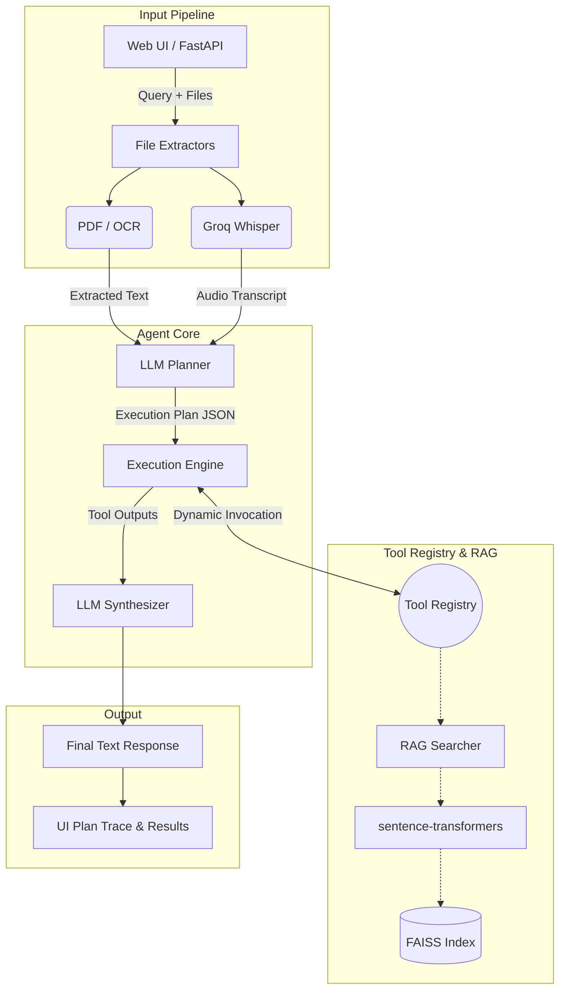

# System Architecture

The Agentic AI Multi-Modal Assistant is designed as a custom, lightweight ReAct loop that avoids bloated orchestration frameworks. 

## High-Level Architecture Diagram

## Component Breakdown

1. **Input Pipeline (`app/main.py` & `app/utils/`)**:
   - Handles multipart form data (text + files).
   - Dynamically routes files to the correct pre-processor (`pytesseract`, `fitz`, or `Groq Whisper`).
   - Gathers all extracted text and forwards it to the Orchestrator.

2. **Agent Core (`app/agent/`)**:
   - `planner.py`: Analyzes the user's query against the extracted file context. Uses strict JSON-schema enforcement to generate an actionable step-by-step tool plan. Capable of detecting ambiguity and halting execution to ask follow-up questions.
   - `executor.py`: A custom engine that parses the JSON plan. Features a **Dynamic File Injection System** which replaces `{{file:filename}}` placeholders with actual massive file texts on-the-fly, protecting the LLM from output-token exhaustion.
   - `synthesizer.py`: Receives the raw tool outputs and constructs a human-readable, polite final response.

3. **Tool Registry (`app/tools/`)**:
   - An extensible plugin architecture where tools are registered via a `@register_tool` decorator.
   - Houses specialized capabilities like `youtube_tool`, `web_fetcher`, `comparator`, and `summarizer`.

4. **RAG Pipeline (`app/utils/rag.py`)**:
   - Intercepts massive documents before they hit the LLM prompt.
   - Slices text into overlapping 800-character chunks.
   - Embeds chunks using the local `all-MiniLM-L6-v2` model.
   - Stores and searches vectors via an in-memory `faiss-cpu` index for sub-millisecond retrieval.
